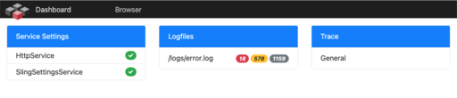
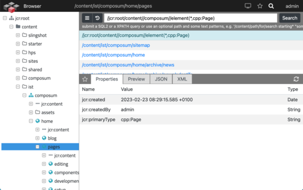

# [Composum](https://www.composum.com/home.html)

yet another Apache Sling based Application Platform (asap)

## Composum Dashboard

[](https://opensource.org/licenses/MIT)

- [releases](https://github.com/ist-dresden/composum-dashboard/releases)

A lightweight framework for setting up a custom set of maintenance and development tools for a Sling or AEM (cloud)
platform.

### Features

- a simple page component to arrange a set of tools in a tiled view with
    - a summarized status information view on each tile
    - the option to open a detailed view for each of the arraged tools
    - the option to add some light versions of the Composum Nodes tools
        - a repository browser to inspect the JCR repository
- with a small footprint of the tools itself in the JCR repository
- customizable and restrictable via OSGi configuration for each environment
- prepared as normal content with no additional configuration needed in the web tier

[](src/site/resources/image/Dashboard.png)

[Picture of the dashboard - click to enlarge](src/site/resources/image/Dashboard.png)

[](src/site/resources/image/JcrBrowser.png)

[Picture of the JCR Browser - click to enlarge](src/site/resources/image/JcrBrowser.png)

### Usage

First, it is necessary that the desired services are activated and configured via OSGi configurations.
At set of configuration examples is delivered in the 'config' packages,
one for a Sling setup and another one for an AEM setup.

* ``sling/config/src/main/content/jcr_root/apps/composum/dashboard/config.composum``
* ``aem/config/src/main/content/jcr_root/apps/composum/dashboard/config.composum``

Only configured services are available.
The user interface is automatically set up with the configured services.
Services that are not configured are not displayed.

Each service implements bsically a servlet with a set of view or request options,
e.g. if the browsers XML view is configured via OSGi with

``com.composum.sling.dashboard.servlet.DashboardXmlView.cfg.json``...

```json
{
  "maxDepth": 0,
  "sourceMode": true,
  "sling.servlet.paths": [
    "/apps/cpm/browser/view/xml",
    "/apps/cpm/browser/view/xml/view",
    "/apps/cpm/browser/view/xml/form",
    "/apps/cpm/browser/view/xml/load"
  ]
}
```

This service is rendering its UI as a servlet via the configured paths with
``/apps/cpm/browser/view/xml.html`` as the main URI to access the service and a set of
servlet paths for the various UI elements of this implementation.

The same service declares a set of resource types (which can be overridden via OSGi)
through which the service can be used like a normal Sling component to embed service into the
content of the repository.

#### the DashboardManager service

The service always needed to use the dashboard components is the DashboardManager service,
which provides the central settings for each of the other services, nothing works without this service.

``com.composum.sling.dashboard.service.SlingDashboardManager.cfg.json`` (AEM variant)...

```json
{
  "allowedPropertyPatterns": [
    "^.*$"
  ],
  "disabledPropertyPatterns": [
    "^rep:.*$",
    "^.*[Pp]assword.*$"
  ],
  "allowedPathPatterns": [
    "^/$",
    "^/content(/.*)?$",
    "^/conf(/.*)?$",
    "^/apps(/.*)?$",
    "^/libs(/.*)?$",
    "^/etc(/.*)?$",
    "^/var(/.*)?$",
    "^/tmp(/.*)?$",
    "^/mnt(/.*)?$",
    "^/oak:index(/.*)?$",
    "^/jcr:system(/.*)?$"
  ],
  "disabledPathPatterns": [
    ".*/rep:.*",
    "^(/.*)?/api(/.*)?$"
  ],
  "sortableTypes": [
    "nt:folder",
    "sling:Folder",
    "cq:Component"
  ],
  "cssRunmodes": [
    "author",
    "publish"
  ],
  "contentPageType": "[cq:Page]/jcr:content[cq:PageContent]",
  "loginUri": "/libs/granite/core/content/login.html"
}
```

For easy and quick setup of the dashboard browser to display the resource properties
the following services are required:

* SlingDashboardManager
* DashboardBrowserServlet
* DashboardPropertiesView

### tools preparation as content

Another way to set up the dashboard widgets is to deploy the desired components as elements of a content page.
Configuring the desired services is also required, but instead of using the declared servlets via the servlet path,
the implemented resource types are used to arrange appropriate Sling components.

To start with that approach create a content page or an AEM cq:Page of the resource type

``composum/dashboard/sling``

and declare your set of Dashboard service implementations and/or
your set of content elements , e.g. ``/content/test/insights``...

<details>
  <summary>example content code (/content/test/insights)</summary>

```xml
<?xml version="1.0" encoding="UTF-8"?>
<jcr:root xmlns:sling="http://sling.apache.org/jcr/sling/1.0" xmlns:cq="http://www.day.com/jcr/cq/1.0"
        xmlns:jcr="http://www.jcp.org/jcr/1.0" xmlns:nt="http://www.jcp.org/jcr/nt/1.0"
        jcr:primaryType="cq:Page">
    <jcr:content
            jcr:primaryType="cq:PageContent"
            jcr:title="Dashboard"
            sling:resourceType="composum/dashboard/sling">
        <navigation
                jcr:primaryType="nt:unstructured">
            <browser
                    jcr:primaryType="nt:unstructured"
                    jcr:title="Browser"
                    linkPath="/content/test/insights/browser">
            </browser>
            <groovyconsole
                    jcr:primaryType="nt:unstructured"
                    jcr:title="Groovy..."
                    linkUrl="/groovyconsole">
            </groovyconsole>
        </navigation>
        <generic jcr:primaryType="nt:unstructured">
        </generic>
        <widgets
                jcr:primaryType="nt:unstructured">
            <service-settings
                    jcr:primaryType="nt:unstructured"
                    sling:resourceType="composum/dashboard/sling/service/settings">
                <tile
                        jcr:primaryType="nt:unstructured"
                        sling:resourceType="composum/dashboard/sling/service/settings/tile"/>
                <view
                        jcr:primaryType="nt:unstructured"
                        sling:resourceType="composum/dashboard/sling/service/settings/view"/>
                <page
                        jcr:primaryType="nt:unstructured"
                        sling:resourceType="composum/dashboard/sling/service/settings/page"/>
            </service-settings>
            <logfiles
                    jcr:primaryType="nt:unstructured"
                    sling:resourceType="composum/dashboard/sling/logfiles">
                <tile
                        jcr:primaryType="nt:unstructured"
                        sling:resourceType="composum/dashboard/sling/logfiles/tile"/>
                <view
                        jcr:primaryType="nt:unstructured"
                        sling:resourceType="composum/dashboard/sling/logfiles/view"/>
                <page
                        jcr:primaryType="nt:unstructured"
                        sling:resourceType="composum/dashboard/sling/logfiles/page"/>
                <tail
                        jcr:primaryType="nt:unstructured"
                        sling:resourceType="composum/dashboard/sling/logfiles/tail"/>
            </logfiles>
        </widgets>
    </jcr:content>
    <browser
            jcr:primaryType="cq:Page">
        <jcr:content
                jcr:primaryType="cq:PageContent"
                jcr:title="Composum Browser"
                sling:resourceType="composum/dashboard/sling/browser">
            <tree
                    jcr:primaryType="nt:unstructured"
                    sling:resourceType="composum/dashboard/sling/browser/tree"/>
            <tool
                    jcr:primaryType="nt:unstructured"
                    sling:resourceType="composum/dashboard/sling/browser/tool">
                <favorites
                        jcr:primaryType="nt:unstructured"
                        sling:resourceType="composum/dashboard/sling/favorites">
                    <view
                            jcr:primaryType="nt:unstructured"
                            sling:resourceType="composum/dashboard/sling/favorites/view"/>
                </favorites>
                <query
                        jcr:primaryType="nt:unstructured"
                        sling:resourceType="composum/dashboard/sling/query">
                    <view
                            jcr:primaryType="nt:unstructured"
                            sling:resourceType="composum/dashboard/sling/query/view"/>
                    <page
                            jcr:primaryType="nt:unstructured"
                            sling:resourceType="composum/dashboard/sling/query/page"/>
                    <find
                            jcr:primaryType="nt:unstructured"
                            sling:resourceType="composum/dashboard/sling/query/find"/>
                    <load
                            jcr:primaryType="nt:unstructured"
                            sling:resourceType="composum/dashboard/sling/query/load"/>
                </query>
            </tool>
            <view
                    jcr:primaryType="nt:unstructured"
                    sling:resourceType="composum/dashboard/sling/browser/view">
                <properties
                        jcr:primaryType="nt:unstructured"
                        sling:resourceType="composum/dashboard/sling/properties">
                    <view
                            jcr:primaryType="nt:unstructured"
                            sling:resourceType="composum/dashboard/sling/properties/view"/>
                    <page
                            jcr:primaryType="nt:unstructured"
                            sling:resourceType="composum/dashboard/sling/properties/page"/>
                </properties>
                <display
                        jcr:primaryType="nt:unstructured"
                        sling:resourceType="composum/dashboard/sling/display">
                    <view
                            jcr:primaryType="nt:unstructured"
                            sling:resourceType="composum/dashboard/sling/display/view"/>
                    <form
                            jcr:primaryType="nt:unstructured"
                            sling:resourceType="composum/dashboard/sling/display/form"/>
                    <load
                            jcr:primaryType="nt:unstructured"
                            sling:resourceType="composum/dashboard/sling/display/load"/>
                </display>
                <caconfig
                        jcr:primaryType="nt:unstructured"
                        sling:resourceType="composum/dashboard/sling/caconfig">
                    <view
                            jcr:primaryType="nt:unstructured"
                            sling:resourceType="composum/dashboard/sling/caconfig/view"/>
                </caconfig>
                <json
                        jcr:primaryType="nt:unstructured"
                        sling:resourceType="composum/dashboard/sling/source/json">
                    <view
                            jcr:primaryType="nt:unstructured"
                            sling:resourceType="composum/dashboard/sling/source/json/view"/>
                    <form
                            jcr:primaryType="nt:unstructured"
                            sling:resourceType="composum/dashboard/sling/source/json/form"/>
                    <load
                            jcr:primaryType="nt:unstructured"
                            sling:resourceType="composum/dashboard/sling/source/json/load"/>
                </json>
                <xml
                        jcr:primaryType="nt:unstructured"
                        sling:resourceType="composum/dashboard/sling/source/xml">
                    <view
                            jcr:primaryType="nt:unstructured"
                            sling:resourceType="composum/dashboard/sling/source/xml/view"/>
                    <form
                            jcr:primaryType="nt:unstructured"
                            sling:resourceType="composum/dashboard/sling/source/xml/form"/>
                    <load
                            jcr:primaryType="nt:unstructured"
                            sling:resourceType="composum/dashboard/sling/source/xml/load"/>
                </xml>
            </view>
        </jcr:content>
    </browser>
</jcr:root>
```

</details>

With this configuration the Dashboard can be opened using th URI ``/content/test/insights.html`` and
the Dashboards Browser will be available via the Dashboards menu and directly
via the URI ``/content/test/insights/browser.html``

### Predefined Widgets and Tools

#### The Browser

The browser implementation is a widget of type 'tool'. The browser implements a 'page' resource type and,
for internal use, a 'tree', a 'tool' and a 'view' with a 'form' resource type.
The tree implementation is part of the browser widget, but the view implementations are not.

The available views themselves are also widgets implemented by their own servlets.
The browser determines the available views by querying the available widgets declared for the Browser context.
Each such widget available through the DashboardManager is displayed in the browser's view pane.

In addition, the browser arranges the service implementations of the 'Tool' category in the browser's tool menu,
which is displayed in the browser above the view pane.

A complete Browser with all predefined element consists of the services:

* SlingDashboardManager
* DashboardBrowserServlet

with the view components:

* DashboardPropertiesView

  to show the resource properties as table with links to follow the path properties

* DashboardDisplayView

  to show the resources rendered as HTML (component based resources) or in the appropriate format (assets)

* DashboardCaConfigView

  to show a set of configured CA configuration settings in the context of the current resource

* DashboardJsonView

  to show the current resource as JSON source code

* DashboardXmlView

  to show the current resource as XML content source code

and the tools

* DashboardFavoritesTool

  to mark resources as favorites and provide these favorites in configured short lists

* DashboardQueryWidget

  to search resources using SQL2, XPath or Text queries

With the following configuration you can be opened the Browser using the URI ``/apps/cpm/browser.html``
If you have prepared the browser as content as described above, both URIs can be used to open the browser.

If you do not want to provide the services through servlet paths,
you can remove all "sling.servlet.paths" from the OSGi configuration.
In that case you must prepare appropriate content for the Dashboard views.

<details>
  <summary>com.composum.sling.dashboard.servlet.DashboardBrowserServlet.cfg.json</summary>

```json
{
  "sling.servlet.paths": [
    "/apps/cpm/browser",
    "/apps/cpm/browser/page",
    "/apps/cpm/browser/view",
    "/apps/cpm/browser/form",
    "/apps/cpm/browser/tool",
    "/apps/cpm/browser/tree"
  ]
}
```

</details>

<details>
  <summary>com.composum.sling.dashboard.servlet.DashboardPropertiesView.cfg.json</summary>

```json
{
  "sling.servlet.paths": [
    "/apps/cpm/browser/view/properties",
    "/apps/cpm/browser/view/properties/view"
  ]
}
```

</details>

<details>
  <summary>com.composum.sling.dashboard.servlet.DashboardDisplayView.cfg.json</summary>

```json
{
  "loadDocuments": true,
  "parameterFields": [
    "name=wcmmode,label=wcmmode,type=select,options=:--|disabled|edit|preview"
  ],
  "sling.servlet.paths": [
    "/apps/cpm/browser/view/display",
    "/apps/cpm/browser/view/display/view",
    "/apps/cpm/browser/view/display/form",
    "/apps/cpm/browser/view/display/load"
  ]
}
```

</details>

<details>
  <summary>com.composum.sling.dashboard.servlet.DashboardCaConfigView.cfg.json</summary>

```json
{
  "inspectedConfigurations": [
    "<your CA configuration implementation class names...>"
  ],
  "sling.servlet.paths": [
    "/apps/cpm/browser/view/caconfig",
    "/apps/cpm/browser/view/caconfig/view"
  ]
}
```

</details>

<details>
  <summary>com.composum.sling.dashboard.servlet.DashboardJsonView.cfg.json</summary>

```json
{
  "maxDepth": 0,
  "sourceMode": true,
  "sling.servlet.paths": [
    "/apps/cpm/browser/view/json",
    "/apps/cpm/browser/view/json/view",
    "/apps/cpm/browser/view/json/form",
    "/apps/cpm/browser/view/json/load"
  ]
}
```

</details>

<details>
  <summary>com.composum.sling.dashboard.servlet.DashboardXmlView.cfg.json</summary>

```json
{
  "maxDepth": 0,
  "sourceMode": true,
  "sling.servlet.paths": [
    "/apps/cpm/browser/view/xml",
    "/apps/cpm/browser/view/xml/view",
    "/apps/cpm/browser/view/xml/form",
    "/apps/cpm/browser/view/xml/load"
  ]
}
```

</details>

<details>
  <summary>com.composum.sling.dashboard.servlet.DashboardFavoritesTool.cfg.json</summary>

```json
{
  "favoriteGroups": [
    "Pages=^/content/(?!(dam)/.*$)",
    "Assets=^/content/(dam)/.*$"
  ],
  "sling.servlet.paths": [
    "/apps/cpm/browser/favorites",
    "/apps/cpm/browser/favorites/view"
  ]
}
```

</details>

<details>
  <summary>com.composum.sling.dashboard.servlet.DashboardQueryWidget.cfg.json</summary>

```json
{
  "queryTemplates": [
    "<your set of frequently used queries for your project...>"
  ],
  "maxResults": 500,
  "sling.servlet.paths": [
    "/apps/cpm/query",
    "/apps/cpm/query/page",
    "/apps/cpm/query/view",
    "/apps/cpm/query/find"
  ]
}
```

</details>


### see also

#### [Composum Nodes](https://github.com/ist-dresden/composum-nodes)

the big brother of the Composum dashboard tools

* [Composum Nodes Homepage](https://www.composum.com/home/nodes.html)

---

#### [Composum Pages](https://github.com/ist-dresden/composum-pages)

* [Composum Pages Homepage](https://www.composum.com/home/pages.html)

#### [Composum Assets](https://github.com/ist-dresden/composum-assets)

* [Composum Homepage](https://www.composum.com/home.html)

#### [Composum Platform](https://github.com/ist-dresden/composum-platform)

* [Composum Platform Homepage](https://www.composum.com/home.html)
